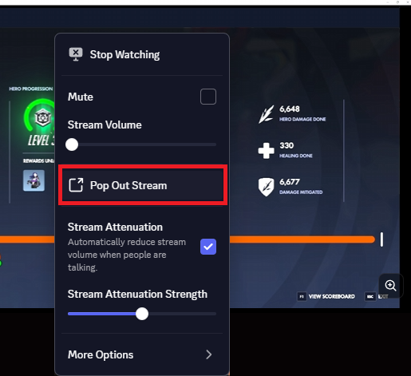
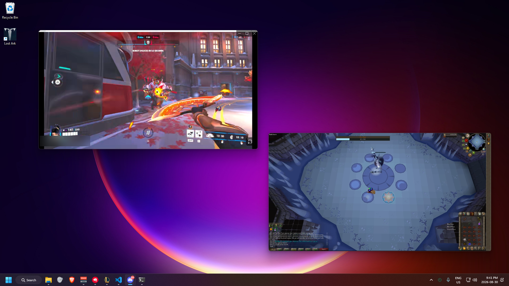

# Installing StreamWindows

Watch several Discord streams at once, each in its **own window**, so you can put
them on different monitors and fullscreen them separately.

Takes about two minutes. You only do this once.

---

## Before you start

- **Desktop Discord only.** This does not work in a browser.
- Only the people **watching** need this. Whoever is streaming doesn't need
  anything.

---

## Step 1 — Install BetterDiscord

1. Go to **https://betterdiscord.app** and download the installer.
2. Run it, choose **Install**, and let it patch Discord.
3. Restart Discord when it asks.

You'll know it worked when Discord's Settings has a **BetterDiscord** section in
the left sidebar.

## Step 2 — Add the plugin

1. Get the file **`StreamWindows.plugin.js`** (whoever sent you this has it).
   If it arrived as a `.zip`, unzip it first — you need the `.js` file itself.
2. In Discord: **Settings → BetterDiscord → Plugins → Open Plugins Folder**.
   A folder opens.
3. **Drag `StreamWindows.plugin.js` into that folder.**

> Don't rename the file. It must keep the `.plugin.js` ending.

## Step 3 — Turn it on

Back in **Settings → Plugins**, find **StreamWindows** and flip the toggle **on**.

Done.

---

## What you're looking for

Join a voice channel where someone is streaming, then **right-click them** —
on their video tile and click **Pop Out Stream**:

Repeat for each person you want to watch. Each gets its own window you can drag
to any monitor:

---

## Updating

There's no auto-update. When you're sent a newer `StreamWindows.plugin.js`, drop
it in the same folder, replace the old one, and restart Discord.

## Uninstalling

- **Just the plugin:** toggle it off in Settings → Plugins, or delete
  `StreamWindows.plugin.js` from the plugins folder.
- **All of BetterDiscord:** run its installer and choose **Uninstall**.

---

